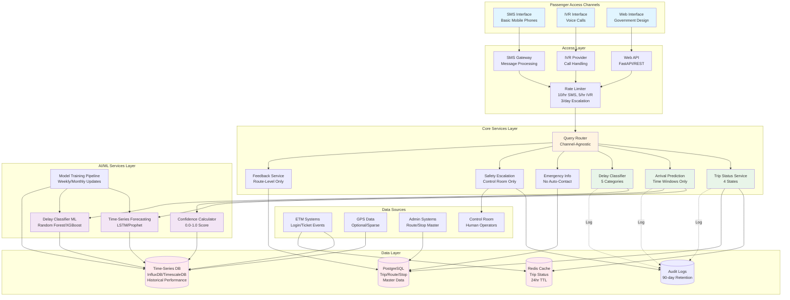
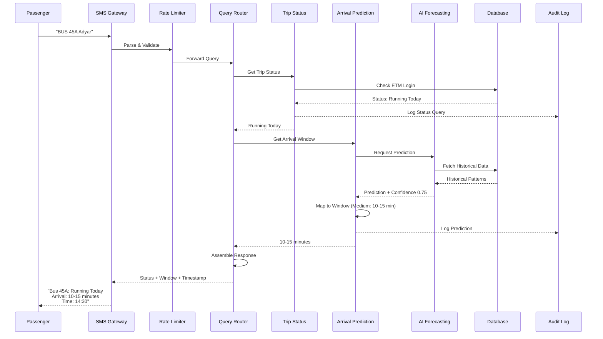
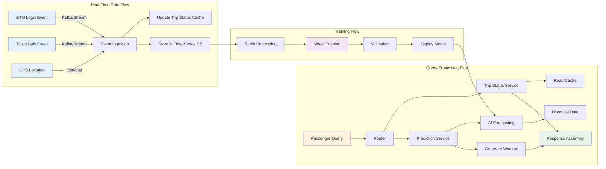

# Design Document: Transit India

## Overview

Transit India is a national-level digital public infrastructure platform that provides honest, inclusive bus information services to passengers across India. The system architecture follows a layered approach with clear separation between passenger-facing interfaces, access channels, core business logic, AI/ML services, and data sources.

The design prioritizes:
- **Honesty over precision**: Time windows instead of exact ETAs, explicit uncertainty acknowledgment
- **Inclusivity by default**: SMS and IVR as first-class channels, no smartphone or internet requirement
- **Privacy by design**: No passenger tracking, stateless query processing, no user accounts
- **Government-grade reliability**: Deterministic decisions, comprehensive audit trails, 99.5% uptime
- **Existing infrastructure**: ETM integration without new hardware, optional GPS support

The system serves State Transport Authorities as the primary operators and passengers as the end users, with all AI/ML components operating as background decision support rather than passenger-facing features.

## Architecture

### System Layers

```
┌─────────────────────────────────────────────────────────────┐
│                    PASSENGER INTERFACES                      │
│              (SMS, IVR, Web - Equal Priority)                │
└─────────────────────────────────────────────────────────────┘
                              ↓
┌─────────────────────────────────────────────────────────────┐
│                      ACCESS LAYER                            │
│     (SMS Gateway, IVR Provider, Web API, Auth/Rate Limit)   │
└─────────────────────────────────────────────────────────────┘
                              ↓
┌─────────────────────────────────────────────────────────────┐
│                    CORE SERVICES LAYER                       │
│  (Trip Status, Arrival Prediction, Delay Classification,    │
│   Emergency Info, Safety Escalation, Feedback, Query Router) │
└─────────────────────────────────────────────────────────────┘
                              ↓
┌─────────────────────────────────────────────────────────────┐
│                   AI/ML SERVICES LAYER                       │
│  (Time-Series Forecasting, Confidence Calculation,           │
│   Delay Classifier, Model Training Pipeline)                 │
└─────────────────────────────────────────────────────────────┘
                              ↓
┌─────────────────────────────────────────────────────────────┐
│                     DATA SOURCES LAYER                       │
│  (ETM Events, Historical Data, GPS (Optional), Route/Stop    │
│   Master Data, Control Room Interface)                       │
└─────────────────────────────────────────────────────────────┘
```

### Detailed Architecture Diagram



### Component Interaction Flow



### Data Flow Architecture



### Architectural Principles

1. **Layered Separation**: Each layer has clear responsibilities and communicates only with adjacent layers
2. **Channel Parity**: All access channels (SMS, IVR, Web) receive identical information from core services
3. **AI as Background Support**: AI/ML services provide decision support to core services but never interact directly with passengers
4. **Stateless Query Processing**: No session management or passenger tracking; each query is independent
5. **Graceful Degradation**: System continues operating when optional components (GPS) are unavailable
6. **Audit-First Design**: All critical decisions are logged with full context for government accountability

## Components and Interfaces

### 1. Access Layer Components

#### SMS Gateway Interface
- **Responsibility**: Parse incoming SMS messages, format outgoing responses
- **Input**: Raw SMS text from mobile network
- **Output**: Structured query object (bus number, stop name, query type)
- **Format Support**: "BUS <BusNumber> <StopName>" or "BUS <BusNumber>"
- **Language Support**: English, Hindi, regional languages via transliteration
- **Error Handling**: Invalid format → guidance message, unknown bus/stop → error with suggestions

#### IVR Service Interface
- **Responsibility**: Handle voice calls, DTMF input, text-to-speech output
- **Input**: Phone call with keypad or voice input
- **Output**: Spoken response in selected language
- **Navigation**: Keypad-first with voice as assistive option
- **Languages**: Tamil, Hindi, English (configurable for additional languages)
- **Prompts**: Short, calm, government-appropriate tone
- **Timeout**: 60 seconds for standard queries

#### Web API Interface
- **Responsibility**: Serve web interface, handle HTTP requests
- **Input**: HTTP GET/POST requests with bus number and stop name
- **Output**: JSON response or HTML page
- **Design**: Government-grade visual design (white/off-white background, navy/indigo primary, muted green accent)
- **Constraints**: No gradients, animations, live maps, countdown timers, or user accounts
- **Accessibility**: Large text (minimum 16px), prominent language toggle

#### Rate Limiter
- **Responsibility**: Prevent abuse and ensure fair access
- **Limits**: 
  - SMS: 10 queries per phone number per hour
  - IVR: 5 calls per phone number per hour
  - Safety escalation: 3 reports per phone number per day
- **Action on Limit**: Reject request with retry-after message

### 2. Core Services Layer Components

#### Trip Status Service
- **Responsibility**: Determine current operational status of trips
- **Inputs**: ETM login events, scheduled departure times, administrative cancellations
- **Outputs**: One of four states: "Running Today", "Not Running", "Status Not Confirmed", "Service Discontinued"
- **Logic**:
  - ETM login → "Running Today"
  - No login by scheduled time + 30 minutes → "Status Not Confirmed"
  - Administrative cancellation → "Not Running"
  - Permanent discontinuation → "Service Discontinued"
- **Storage**: Trip status cache with TTL (time-to-live) of 24 hours

#### Arrival Prediction Service
- **Responsibility**: Generate honest arrival time windows
- **Inputs**: Bus number, stop name, current time, AI prediction with confidence
- **Outputs**: Arrival window (min-max minutes) or "Status Not Confirmed"
- **Logic**:
  - High confidence (>80%) → Narrow window (5-minute range)
  - Medium confidence (50-80%) → Medium window (10-minute range)
  - Low confidence (<50%) → Wide window (15-minute range)
  - Very low confidence (<30%) → "Status Not Confirmed"
- **Constraints**: Never return exact ETA, always return range or uncertainty

#### Delay Reason Classifier
- **Responsibility**: Provide single, honest delay reason
- **Inputs**: Current delay amount, AI classification result, historical patterns
- **Outputs**: One of: "Heavy traffic", "Late departure", "Road diversion", "Service disruption", "Status unknown"
- **Logic**:
  - Use AI classifier for initial categorization
  - Select single most significant reason
  - Default to "Status unknown" when uncertain
  - Never attribute to individual staff
- **Constraints**: One reason only, no speculation

#### Emergency Information Service
- **Responsibility**: Provide quick access to bus and helpline information
- **Inputs**: Bus number or trip identifier
- **Outputs**: Bus number, route ID, last confirmed stop, state-specific helpline numbers
- **Response Time**: Under 5 seconds
- **Constraints**: Information only, no automatic emergency service contact

#### Safety Escalation Service
- **Responsibility**: Route verified safety reports to human control room
- **Inputs**: Phone number, bus number, incident category (harassment, fight, medical, threat)
- **Outputs**: Escalation ticket to control room, confirmation to reporter
- **Validation**: 
  - Require bus number and category
  - Check rate limits (3 per phone per day)
  - No anonymous reports
- **Routing**: Human control room only, not police
- **Audit**: Full audit trail with timestamps

#### Feedback Service
- **Responsibility**: Collect and aggregate route-level feedback
- **Inputs**: Route ID, time period, feedback type (Satisfactory/Needs Improvement)
- **Outputs**: Confirmation message, aggregated data for authorities
- **Constraints**: 
  - Route-level only, not driver-specific
  - No public display
  - Aggregate only for authority access

#### Query Router
- **Responsibility**: Route incoming queries to appropriate services
- **Inputs**: Structured query from access layer
- **Outputs**: Formatted response for access layer
- **Logic**:
  - Standard query → Trip Status + Arrival Prediction + Delay Reason
  - Emergency query → Emergency Information Service
  - Safety escalation → Safety Escalation Service
  - Feedback → Feedback Service

### 3. AI/ML Services Layer Components

#### Time-Series Forecasting Engine
- **Responsibility**: Predict arrival times using historical patterns
- **Algorithm**: LSTM (Long Short-Term Memory) or Prophet for time-series forecasting
- **Inputs**: 
  - Historical arrival times at stop (12 months minimum)
  - Time of day, day of week, season
  - ETM timestamps from current trip
  - Optional GPS location if available
- **Outputs**: Predicted arrival time with confidence interval
- **Training**: Periodic retraining (weekly) using accumulated data
- **Constraints**: Background service only, no direct passenger interaction

#### Confidence Calculator
- **Responsibility**: Assess prediction reliability
- **Inputs**: 
  - Prediction variance from forecasting model
  - Data recency (time since last ETM event)
  - GPS availability (present/absent)
  - Historical accuracy for this route/time
- **Outputs**: Confidence percentage (0-100%)
- **Logic**:
  - Recent ETM data + GPS → High confidence
  - Recent ETM data, no GPS → Medium confidence
  - Old ETM data → Low confidence
  - No recent data → Very low confidence

#### Delay Classifier
- **Responsibility**: Categorize delay reasons using machine learning
- **Algorithm**: Multi-class classification (Random Forest or Gradient Boosting)
- **Inputs**:
  - Delay amount (minutes)
  - Time of day (rush hour indicator)
  - Historical delay patterns for route
  - Optional GPS speed data
  - Road event data (if available)
- **Outputs**: Delay category with confidence score
- **Training**: Monthly retraining using labeled historical data
- **Classes**: Heavy traffic, Late departure, Road diversion, Service disruption

#### Model Training Pipeline
- **Responsibility**: Periodic retraining of AI models
- **Schedule**: 
  - Forecasting models: Weekly
  - Delay classifier: Monthly
- **Data**: Historical ETM events, GPS logs, feedback data
- **Validation**: Hold-out test set, accuracy metrics, A/B testing before deployment
- **Rollback**: Automatic rollback if new model performs worse than baseline

### 4. Data Sources Layer Components

#### ETM Event Ingestion
- **Responsibility**: Receive and process ETM events in real-time
- **Event Types**:
  - Trip Start (login event)
  - Ticket Sale (with stop ID and timestamp)
  - Trip End (logout event)
- **Format**: JSON or CSV export from ETM systems
- **Frequency**: Real-time or near-real-time (within 2 minutes)
- **Storage**: Event stream (Kafka/Kinesis) → Time-series database

#### Historical Data Store
- **Responsibility**: Store and serve historical performance data
- **Data**: 
  - Stop-level arrival times (12+ months)
  - Route performance metrics
  - Delay patterns by time/day/season
- **Database**: Time-series database (InfluxDB or TimescaleDB)
- **Retention**: Minimum 12 months for model training
- **Aggregation**: Pre-computed aggregates for common queries

#### GPS Data Ingestion (Optional)
- **Responsibility**: Receive sparse GPS location updates when available
- **Frequency**: Every 5-10 minutes (not continuous)
- **Format**: Latitude, longitude, timestamp, bus ID
- **Usage**: Supplementary input for arrival prediction
- **Constraint**: System must function fully without GPS

#### Route and Stop Master Data
- **Responsibility**: Maintain authoritative route and stop information
- **Data**:
  - Route definitions (stops in sequence)
  - Stop locations and names (multilingual)
  - Scheduled timetables
  - Service status (active/discontinued)
- **Source**: State Transport Authority administrative systems
- **Update Frequency**: Daily batch updates
- **Database**: Relational database (PostgreSQL)

#### Control Room Interface
- **Responsibility**: Provide human operators with escalation management tools
- **Features**:
  - View incoming safety escalations
  - Access bus location and trip details
  - Contact reporter via phone
  - Log resolution actions
  - Generate incident reports
- **Access**: Authenticated control room staff only
- **Audit**: All actions logged with operator ID and timestamp

## Data Models

### Trip Status Model
```
TripStatus {
  trip_id: String (unique identifier)
  route_id: String
  bus_number: String
  scheduled_departure: DateTime
  status: Enum ["Running Today", "Not Running", "Status Not Confirmed", "Service Discontinued"]
  last_updated: DateTime
  etm_login_time: DateTime (nullable)
  administrative_note: String (nullable)
}
```

### Arrival Prediction Model
```
ArrivalPrediction {
  trip_id: String
  stop_id: String
  query_time: DateTime
  predicted_arrival_min: Integer (minutes from now)
  predicted_arrival_max: Integer (minutes from now)
  confidence_level: Float (0.0 to 1.0)
  data_sources_used: Array<String> ["ETM", "Historical", "GPS"]
  prediction_id: String (for audit)
}
```

### Delay Information Model
```
DelayInformation {
  trip_id: String
  current_delay_minutes: Integer
  delay_reason: Enum ["Heavy traffic", "Late departure", "Road diversion", "Service disruption", "Status unknown"]
  classification_confidence: Float (0.0 to 1.0)
  timestamp: DateTime
}
```

### Query Request Model
```
QueryRequest {
  request_id: String (unique)
  channel: Enum ["SMS", "IVR", "Web"]
  phone_number: String (nullable, for SMS/IVR)
  bus_number: String
  stop_name: String (nullable)
  language: String (ISO 639-1 code)
  timestamp: DateTime
}
```

### Query Response Model
```
QueryResponse {
  request_id: String
  trip_status: String
  arrival_window: String (e.g., "15-20 minutes" or "Status Not Confirmed")
  delay_reason: String (nullable)
  response_timestamp: DateTime
  language: String
}
```

### Safety Escalation Model
```
SafetyEscalation {
  escalation_id: String (unique)
  phone_number: String (hashed for privacy)
  bus_number: String
  trip_id: String (nullable)
  incident_category: Enum ["Harassment", "Fight", "Medical", "Threat"]
  timestamp: DateTime
  control_room_status: Enum ["Pending", "In Progress", "Resolved"]
  resolution_notes: String (nullable)
  operator_id: String (nullable)
}
```

### Feedback Model
```
Feedback {
  feedback_id: String (unique)
  route_id: String
  time_period: DateTime (rounded to hour)
  feedback_type: Enum ["Satisfactory", "Needs Improvement"]
  channel: Enum ["SMS", "IVR", "Web"]
  timestamp: DateTime
}
```

### ETM Event Model
```
ETMEvent {
  event_id: String (unique)
  event_type: Enum ["TripStart", "TicketSale", "TripEnd"]
  trip_id: String
  bus_number: String
  stop_id: String (nullable, for TicketSale)
  timestamp: DateTime
  etm_device_id: String
}
```

### Historical Performance Model
```
HistoricalPerformance {
  route_id: String
  stop_id: String
  scheduled_time: Time
  actual_arrival_time: DateTime
  delay_minutes: Integer
  day_of_week: Integer (1-7)
  season: String
  recorded_date: Date
}
```


## Correctness Properties

*A property is a characteristic or behavior that should hold true across all valid executions of a system—essentially, a formal statement about what the system should do. Properties serve as the bridge between human-readable specifications and machine-verifiable correctness guarantees.*

### Property 1: Trip Status Validity

*For any* trip status query, the system should return exactly one of the four valid status values: "Running Today", "Not Running", "Status Not Confirmed", or "Service Discontinued".

**Validates: Requirements 1.1, 1.2, 1.3, 1.4, 1.6**

### Property 2: ETM Login Triggers Running Status

*For any* trip that receives an ETM login event, the trip status should be set to "Running Today" immediately after processing the event.

**Validates: Requirements 1.1, 12.3**

### Property 3: Timeout Triggers Unconfirmed Status

*For any* trip that has not received an ETM login by its scheduled departure time plus 30 minutes, the trip status should be "Status Not Confirmed".

**Validates: Requirements 1.2**

### Property 4: Arrival Window Format

*For any* arrival prediction with sufficient confidence, the system should return a time window with both minimum and maximum values (a range), and should never return a single exact ETA value.

**Validates: Requirements 2.1, 17.4**

### Property 5: Confidence Determines Window Width

*For any* arrival prediction, higher confidence levels should produce narrower time windows, and lower confidence levels should produce wider time windows, following a monotonic relationship.

**Validates: Requirements 2.2, 2.3**

### Property 6: Low Confidence Returns Uncertainty

*For any* prediction request where confidence is below the reliability threshold (30%), the system should return "Status Not Confirmed" rather than a speculative time window.

**Validates: Requirements 2.4, 17.1, 17.2**

### Property 7: System Functions Without GPS

*For any* query or prediction request, the system should produce valid responses when GPS data is absent, using only ETM timestamps and historical data.

**Validates: Requirements 2.6, 2.7, 12.5, 18.5**

### Property 8: AI Predictions Include Confidence

*For any* arrival prediction generated by the AI service, the prediction should include a confidence level value between 0.0 and 1.0.

**Validates: Requirements 3.3, 3.4**

### Property 9: Delay Reason Validity

*For any* delay classification, the system should return exactly one of the five valid delay reasons: "Heavy traffic", "Late departure", "Road diversion", "Service disruption", or "Status unknown".

**Validates: Requirements 4.1, 4.2**

### Property 10: Uncertain Delays Return Unknown

*For any* delay scenario where the classification confidence is insufficient or data is ambiguous, the system should return "Status unknown" rather than speculating.

**Validates: Requirements 4.3, 4.4, 17.3**

### Property 11: No Staff Attribution in Delays

*For any* delay reason response, the response should not contain driver names, staff IDs, or any individual personnel identifiers.

**Validates: Requirements 4.5**

### Property 12: SMS Parsing Extracts Components

*For any* valid SMS message in the format "BUS <BusNumber> <StopName>" or "BUS <BusNumber>", the parser should correctly extract the bus number and optional stop name as separate components.

**Validates: Requirements 5.1, 5.2**

### Property 13: Query Response Completeness

*For any* successful query (SMS, IVR, or Web), the response should include running status, arrival window (or uncertainty message), delay reason (if applicable), and timestamp.

**Validates: Requirements 5.3, 6.7, 10.1**

### Property 14: Multilingual Query Support

*For any* query submitted in Tamil, Hindi, or English, the system should process the query correctly and return a response in the same language.

**Validates: Requirements 5.5, 13.3**

### Property 15: Invalid Input Error Handling

*For any* query with an invalid bus number or stop name, the system should return a clear error message with guidance rather than failing silently or returning incorrect information.

**Validates: Requirements 5.6**

### Property 16: Language Consistency

*For any* interaction (SMS, IVR, Web) where a language is selected, all subsequent responses in that interaction should be in the selected language.

**Validates: Requirements 6.4, 13.3**

### Property 17: Emergency Information Completeness

*For any* emergency information request, the response should include bus number, route identifier, last confirmed stop, and state-specific helpline numbers.

**Validates: Requirements 7.1, 7.5**

### Property 18: No Automatic Emergency Contact

*For any* emergency information request or safety escalation, the system should not automatically contact police or emergency services without human control room intervention.

**Validates: Requirements 7.2, 8.2**

### Property 19: Safety Escalation Category Validation

*For any* safety escalation submission, the system should accept the report only if the incident category is one of: "Harassment", "Fight", "Medical", or "Threat", and should reject all other categories.

**Validates: Requirements 8.1**

### Property 20: Safety Escalation Rate Limiting

*For any* phone number, the system should accept a maximum of 3 safety escalation reports per 24-hour period, and should reject subsequent reports with helpline information.

**Validates: Requirements 8.4, 8.7**

### Property 21: Safety Escalation Requires Identification

*For any* safety escalation attempt without a phone number, the system should reject the report and require identification.

**Validates: Requirements 8.6**

### Property 22: Feedback Category Validation

*For any* feedback submission, the system should accept only "Satisfactory" or "Needs Improvement" as valid feedback types, and should reject all other values.

**Validates: Requirements 9.1**

### Property 23: Feedback Route-Level Association

*For any* feedback submission, the stored feedback record should be associated with route ID and time period, and should not contain driver IDs or individual bus identifiers.

**Validates: Requirements 9.2**

### Property 24: Feedback Not Publicly Displayed

*For any* passenger-facing interface (SMS response, IVR response, Web page), the interface should not display feedback scores or aggregated feedback data.

**Validates: Requirements 9.3**

### Property 25: Feedback Confirmation Without Scores

*For any* feedback submission, the confirmation message should acknowledge receipt but should not include aggregate scores or comparative data.

**Validates: Requirements 9.6**

### Property 26: No Passenger Location Storage

*For any* query processed by the system, the system should not store the passenger's location, GPS coordinates, or any location-derived data in persistent storage.

**Validates: Requirements 11.1**

### Property 27: No Passenger Profile Creation

*For any* query or series of queries from a phone number, the system should not create passenger profiles, travel history, or link multiple queries together in persistent storage.

**Validates: Requirements 11.2, 11.4**

### Property 28: Anonymized Usage Statistics Only

*For any* usage data stored for system improvement, the data should be aggregated and anonymized, containing no personally identifiable information (PII) such as phone numbers or individual query details.

**Validates: Requirements 11.5**

### Property 29: ETM Event Processing

*For any* ETM event (login, ticket sale, logout), the system should process the event and update relevant trip status or stop-level timestamp data within the processing pipeline.

**Validates: Requirements 12.3, 12.4, 18.1, 18.2**

### Property 30: Comprehensive Audit Logging

*For any* critical decision (trip status change, arrival prediction, delay classification, safety escalation), the system should create an audit log entry containing timestamps, input data, decision rationale, and confidence levels.

**Validates: Requirements 3.6, 8.5, 16.1, 16.2, 16.3, 16.4**

### Property 31: Audit Log Retention

*For any* audit log entry, the entry should be retained in storage for a minimum of 90 days before being eligible for deletion.

**Validates: Requirements 16.6**

### Property 32: Historical Data Retention

*For any* historical performance data (stop-level arrival times, route performance), the data should be retained for a minimum of 12 months to support AI model training.

**Validates: Requirements 18.6**


## Error Handling

### Error Categories

The system handles errors across four categories, each with specific strategies:

#### 1. Input Validation Errors

**Scenarios:**
- Invalid bus number format
- Unknown stop name
- Malformed SMS syntax
- Invalid feedback category
- Invalid safety escalation category

**Handling Strategy:**
- Return clear, actionable error messages in the user's selected language
- Provide guidance on correct format (e.g., "Format: BUS <BusNumber> <StopName>")
- Suggest similar valid values when possible (e.g., nearby stop names)
- Never fail silently - always acknowledge the query with helpful feedback
- Log validation errors for system improvement (aggregated, no PII)

**Example Response:**
```
"Bus number not found. Please check the bus number and try again. Format: BUS 45A Adyar"
```

#### 2. Data Unavailability Errors

**Scenarios:**
- ETM has not logged in (trip status unknown)
- Insufficient historical data for prediction
- GPS unavailable and ETM data too old
- Route or stop master data not loaded

**Handling Strategy:**
- Return explicit uncertainty: "Status Not Confirmed" or "Status unknown"
- Never speculate or provide false information
- Provide alternative information when available (e.g., scheduled time, helpline number)
- Degrade gracefully - provide partial information if some data is available
- Log data gaps for operational monitoring

**Example Response:**
```
"Status Not Confirmed. Bus 45A schedule shows departure at 9:00 AM. For updates, call 1800-XXX-XXXX"
```

#### 3. System and Integration Errors

**Scenarios:**
- SMS gateway timeout
- IVR provider connection failure
- Database connection error
- AI service unavailable
- ETM data feed interruption

**Handling Strategy:**
- Retry transient failures with exponential backoff (3 attempts)
- Fall back to cached data when real-time data is unavailable
- Return "Service temporarily unavailable" for persistent failures
- Continue operating with degraded functionality when possible
- Alert operations team for persistent failures
- Maintain circuit breakers for external dependencies

**Example Response:**
```
"Service temporarily unavailable. Please try again in a few minutes or call 1800-XXX-XXXX"
```

#### 4. Rate Limiting and Abuse Prevention

**Scenarios:**
- SMS query rate limit exceeded (10/hour)
- IVR call rate limit exceeded (5/hour)
- Safety escalation rate limit exceeded (3/day)
- Suspected automated abuse

**Handling Strategy:**
- Return clear rate limit message with retry-after time
- Provide alternative contact methods (helpline numbers)
- Log rate limit violations for abuse pattern detection
- Implement progressive rate limiting (stricter for repeat offenders)
- Maintain whitelist for authorized high-volume users (e.g., control room)

**Example Response:**
```
"Query limit reached. Please try again after 30 minutes or call 1800-XXX-XXXX for immediate assistance"
```

### Error Response Format

All error responses follow a consistent structure across channels:

**SMS Error Format:**
```
[Error Type]: [Clear explanation]. [Guidance or alternative action]. [Helpline if applicable]
```

**IVR Error Format:**
```
Spoken: "I'm sorry, [error explanation]. [Guidance]. You can also call [helpline number] for assistance."
```

**Web Error Format:**
```json
{
  "status": "error",
  "error_type": "validation_error|data_unavailable|system_error|rate_limit",
  "message": "Clear explanation in selected language",
  "guidance": "Suggested action",
  "helpline": "1800-XXX-XXXX",
  "timestamp": "ISO 8601 timestamp"
}
```

### Logging and Monitoring

**Error Logging Requirements:**
- All errors logged with severity level (INFO, WARN, ERROR, CRITICAL)
- Include request context (channel, language, anonymized identifier)
- Include error category and specific error code
- Include timestamp and processing duration
- Aggregate errors for pattern detection
- Alert on error rate thresholds (>5% error rate triggers alert)

**Monitoring Dashboards:**
- Real-time error rate by category and channel
- Data availability metrics (ETM feed health, GPS availability)
- Response time percentiles (p50, p95, p99)
- Rate limiting events by phone number pattern
- AI service health (prediction confidence distribution)

## Testing Strategy

### Dual Testing Approach

Transit India requires comprehensive testing using both unit tests and property-based tests. These approaches are complementary:

- **Unit tests**: Verify specific examples, edge cases, and error conditions
- **Property-based tests**: Verify universal properties across all inputs

Both are necessary for government-grade reliability and correctness.

### Unit Testing Strategy

**Focus Areas:**
1. **Specific Examples**: Test known scenarios with expected outcomes
   - Example: ETM login at 9:00 AM → Status "Running Today"
   - Example: SMS "BUS 45A Adyar" → Parsed correctly
   - Example: Emergency query → Includes helpline numbers

2. **Edge Cases**: Test boundary conditions and unusual inputs
   - Empty bus number
   - Stop name with special characters
   - Query exactly at scheduled departure time
   - Rate limit boundary (3rd vs 4th escalation)

3. **Error Conditions**: Test all error scenarios
   - Invalid bus number
   - Malformed SMS syntax
   - Database connection failure
   - AI service timeout

4. **Integration Points**: Test component interactions
   - SMS Gateway → Query Router → Trip Status Service
   - ETM Event → Data Ingestion → Status Update
   - AI Service → Arrival Prediction → Response Formatter

**Unit Test Organization:**
- Organize by component (Trip Status Service, SMS Parser, etc.)
- Use descriptive test names (e.g., `test_etm_login_sets_running_status`)
- Mock external dependencies (SMS gateway, database, AI service)
- Aim for 80%+ code coverage

### Property-Based Testing Strategy

**Property-based testing is critical for Transit India** because the system must handle infinite variations of inputs (bus numbers, stop names, times, languages) and maintain correctness guarantees across all of them.

**Testing Library:**
- **Python**: Use `hypothesis` library
- **TypeScript/JavaScript**: Use `fast-check` library
- **Java**: Use `jqwik` or `QuickCheck` library

**Configuration:**
- Minimum 100 iterations per property test (due to randomization)
- Increase to 1000 iterations for critical properties (status validity, privacy)
- Use shrinking to find minimal failing examples
- Seed random generator for reproducible failures

**Property Test Organization:**

Each correctness property from the design document should be implemented as a property-based test with the following tag format:

```python
# Feature: transit-india, Property 1: Trip Status Validity
@given(trip_status_query())
def test_trip_status_returns_valid_value(query):
    response = system.query_trip_status(query)
    assert response.status in ["Running Today", "Not Running", 
                                "Status Not Confirmed", "Service Discontinued"]
```

**Generator Strategy:**

Property tests require generators for random test data:

1. **Trip Generators**: Random trip IDs, routes, scheduled times
2. **ETM Event Generators**: Random login/ticket sale events with valid timestamps
3. **Query Generators**: Random bus numbers, stop names, languages
4. **SMS Message Generators**: Valid and invalid SMS formats
5. **Time Generators**: Random times of day, dates, time windows
6. **Confidence Generators**: Random confidence values (0.0-1.0)

**Critical Properties to Test:**

High-priority properties that must be thoroughly tested:

1. **Status Validity** (Property 1): Every query returns valid status
2. **Window Format** (Property 4): Never return exact ETA
3. **GPS Independence** (Property 7): System works without GPS
4. **No Staff Attribution** (Property 11): Responses never contain staff IDs
5. **No Passenger Tracking** (Properties 26-28): No PII stored
6. **Rate Limiting** (Property 20): Limits enforced correctly
7. **Audit Logging** (Property 30): All decisions logged

### Integration Testing

**End-to-End Scenarios:**
1. SMS query → Full response pipeline → SMS response
2. IVR call → Voice navigation → Spoken response
3. ETM login event → Status update → Query reflects new status
4. Safety escalation → Control room notification → Audit log

**Multi-Channel Parity Testing:**
- Same query via SMS, IVR, Web → Identical core information
- Language selection → Consistent language across interaction
- Error scenarios → Consistent error handling across channels

**Performance Testing:**
- Load testing: 10,000 concurrent queries
- Response time: 95th percentile under 10 seconds for SMS
- Sustained load: 24-hour test at 50% peak capacity
- Degradation testing: GPS unavailable, AI service slow

### Acceptance Testing

**Government Stakeholder Testing:**
- State Transport Authority review of responses
- Control room operator testing of escalation workflow
- Accessibility testing with non-smartphone users
- Multilingual testing with native speakers

**Pilot Deployment:**
- Single route pilot for 2 weeks
- Monitor error rates, response times, user feedback
- Validate AI prediction accuracy against actual arrivals
- Adjust confidence thresholds based on real-world performance

### Continuous Testing

**Automated Test Suite:**
- Run on every code commit (CI/CD pipeline)
- Unit tests: ~5 minutes
- Property tests: ~15 minutes
- Integration tests: ~30 minutes
- Full suite must pass before deployment

**Production Monitoring:**
- Synthetic queries every 5 minutes (canary testing)
- Real-time error rate monitoring
- Prediction accuracy tracking (compare predictions to actual arrivals)
- Weekly accuracy reports for AI model performance

### Test Data Management

**Test Data Requirements:**
- Anonymized production data for realistic testing
- Synthetic data generators for property tests
- Fixed test datasets for regression testing
- Multilingual test data (Tamil, Hindi, English)

**Data Privacy in Testing:**
- Never use real passenger phone numbers in tests
- Anonymize all ETM data used in testing
- Use synthetic bus numbers and routes for unit tests
- Ensure test databases are isolated from production

